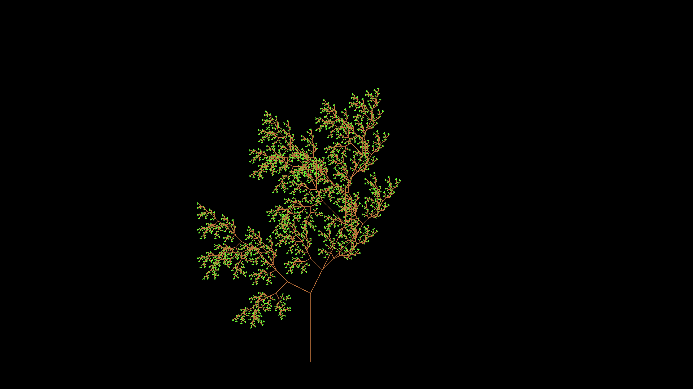

# [L-Systems](https://en.wikipedia.org/wiki/L-system)

The purpose of a project is to create a model of a plant and calculate its fractal dimension using Minkowski dimension (box-counting dimension).

# How does the program work?

#### Let's consider one simple example:

  1. We choose an axiom, e.g. 'F'
  2. We have a certain set of rules, e.g. "F becomes FA" and "A becomes AF"
  3. Iterate the axiom through the set of rules n times, e.g.
      Iterating 4 times:
      F -> FA

      FA -> FAAF

      FAAF -> FAAFAFFA

      FAAFAFFA -> FAAFAFFAAFFAFAAF
    4. Process the result string onto the screen using a few rules.
    5. The processing of the string works by checking char by char due to the processing rules and do what they say.
       If there's something that doesn't fit any rules, it doesn't matter, it will be ignored.
       
# [Minkowski dimension(box-counting dimension)](https://en.wikipedia.org/wiki/Minkowski%E2%80%93Bouligand_dimension#:~:text=In%20fractal%20geometry%2C%20the%20Minkowski,space%20(X%2C%20d).)

Minkowski dimension is a notion of dimension for fractals, measuring how complexity of detail
changes with the scale at which one views the fractal. Very roughly, the larger a fractal's Minkowski dimension,
the more self-similar the fractal is, in the sense that the fractal contains many constricted copies of itself.

#### Technically, for calculating Minkowski dimension we need to:

  1. Cover object with square grid (cell size must be known).
  2. Count the number of cells, which contain a part of object. Save values N and e, where N is number of "filled" cells, and e is cell size.
  3. Detailing grid (decreasing cell size). Obviously, number of "filled" cells will increase. Save new values N and e.
  4. Repeat procedure for many times.

According to the method of calculating the Minkowski dimension, its value will be equal to the angular coefficient of the regression line
constructed on the plane of the ranks of values of log(N) and log(1/e).
